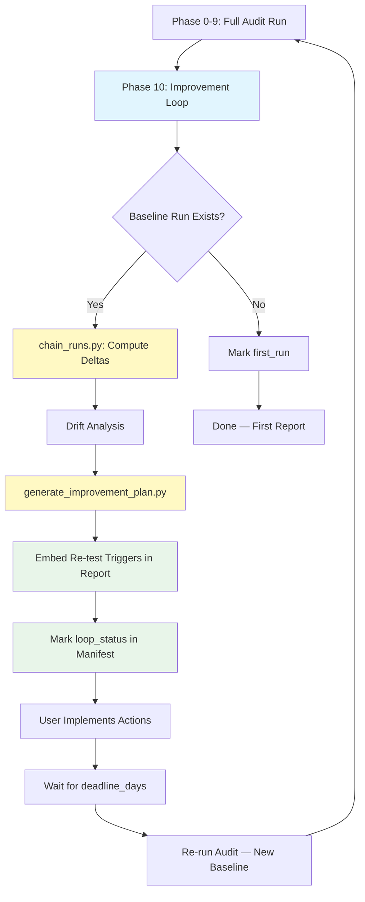

# Loop Engineering — Continuous Improvement Loop for GEO Audits

## Goal

Turn a single GEO audit into a **repeatable improvement cycle**. Each audit run
is not a one-off report — it is a node in a chain. By linking runs, measuring
drift between them, and generating targeted improvement plans, the skill drives
continuous visibility gains instead of point-in-time snapshots.

---

## Run Chain Model

Every audit run produces a `manifest.json` that records the run's identity,
status, and key metrics. When a new run is performed for the same brand, it can
be **chained** to a previous baseline run.

```
┌──────────────┐    chain_runs.py    ┌──────────────┐
│ Baseline Run │ ──────────────────► │ Current Run  │
│  (run_id A)  │   run_chain.json    │  (run_id B)  │
└──────────────┘                     └──────────────┘
```

### Chain Record (`run_chain.json`)

| Field | Type | Description |
|-------|------|-------------|
| `baseline_id` | `str` | Run ID of the baseline |
| `current_id` | `str` | Run ID of the current run |
| `chained_at` | `str` | ISO timestamp |
| `deltas` | `dict` | Per-metric delta map (see below) |
| `improvement_direction` | `str` | `"improving"` / `"maintaining"` / `"regressing"` |

### Metric Deltas

Each tracked metric yields a delta record:

```json
{
  "mention_rate": { "baseline": 0.30, "current": 0.60, "delta": 0.30 },
  "geo_score":    { "baseline": 45.0, "current": 68.0, "delta": 23.0 }
}
```

Tracked metrics:
- `mention_rate` — brand mention rate across questions
- `recommendation_rate` — positive recommendation rate
- `geo_score` — composite GEO score (0–100)
- `visibility_score` — overall visibility score

### Improvement Direction

- **Improving**: majority of key metrics show positive deltas
- **Maintaining**: deltas are within ±5% (no significant change)
- **Regressing**: majority of key metrics show negative deltas

---

## Improvement Plan Generation

After computing deltas, the skill generates a structured **improvement plan**
from two inputs:

1. **Drift analysis** — which questions drifted negatively (critical drifts)
2. **Opportunities** — ranked content and technical opportunities

### Action Types

| Type | Default Retest (days) | Description |
|------|-----------------------|-------------|
| `create_content` | 14 | Create new content to fill gaps |
| `update_content` | 7 | Update existing content (freshness, accuracy) |
| `fix_misperception` | 7 | Correct AI-generated misperceptions |
| `build_backlinks` | 30 | Earn backlinks from authoritative sources |
| `fix_technical` | 3 | Fix technical SEO / crawlability issues |
| `expand_coverage` | 14 | Expand coverage to more platforms/questions |

### Action Schema

Each action in the plan contains:

```json
{
  "priority": 1,
  "action_type": "create_content",
  "target_question_ids": ["q-001", "q-009"],
  "description": "Create a comprehensive buying guide...",
  "expected_impact": "Increase recommendation_rate for purchase-intent questions",
  "validation_method": "Re-run search for q-001 and q-009; verify mention improves",
  "deadline_days": 14
}
```

### Priority Rules

| Priority | Trigger |
|----------|---------|
| 1 | Critical drift on high-value question |
| 2 | Critical drift on medium-value question, or large opportunity (score ≥ 80) |
| 3 | Warning drift + matching opportunity |
| 4 | Standalone high-value opportunity |
| 5 | Low-impact or exploratory |

---

## Re-test Triggers

Each improvement action includes:
- `deadline_days` — when to re-test after implementing the action
- `validation_method` — what to check in the re-test run

The **30-day action timeline** embedded in the report lists all actions with
their target re-test dates. The manifest records `next_retest_date` for
automated follow-up.

### Re-test Flow

1. Action is completed (e.g., new content published)
2. Wait for `deadline_days` (search engines / AI models need time to re-index)
3. Run a new audit (quick mode) targeting the specific `target_question_ids`
4. Compare the new run against the post-action baseline
5. If improvement is confirmed → action is validated
6. If no improvement → escalate priority or try alternative action

---

## Loop Status

Each run is classified into one of four loop states:

| Status | Condition |
|--------|-----------|
| `first_run` | No baseline exists |
| `improving` | Most key metrics have positive deltas |
| `maintaining` | Deltas are within noise threshold |
| `regressing` | Most key metrics have negative deltas |

The manifest records:
- `loop_status` — current loop state
- `improvement_plan_generated` — whether a plan was produced
- `next_retest_date` — ISO date for next scheduled re-test

---

## Feedback Loop Diagram



---

## Agent Usage Guide

### Prerequisites

- At least one completed audit run (baseline)
- Current run must be at Phase 9 (report rendered) or later

### Step 1: Chain Runs

```bash
python <SKILL>/scripts/chain_runs.py \
  --current-run-dir <RUN> \
  --baseline-run-dir <BASELINE_RUN> \
  --output <RUN>/intermediate/run_chain.json
```

This loads both manifests, computes metric deltas, and writes `run_chain.json`.

### Step 2: Generate Improvement Plan

```bash
python <SKILL>/scripts/generate_improvement_plan.py \
  --drift <RUN>/intermediate/drift_analysis.json \
  --opportunities <RUN>/intermediate/opportunities.json \
  --metrics <RUN>/intermediate/metrics.json \
  --output <RUN>/output/improvement_plan.json
```

This produces a prioritized action plan with deadlines and validation methods.

### Step 3: Embed in Report

Update the report to include:
- A "30-Day Action Timeline" section listing all actions with re-test dates
- The `loop_status` and `next_retest_date` in the manifest

### Step 4: Schedule Re-test

Record `next_retest_date` in the manifest. When the date arrives, trigger a
quick-mode audit targeting the specific questions from the improvement plan.

### Error Handling

- If `drift_analysis.json` does not exist, skip drift-based actions (opportunity-only plan)
- If `opportunities.json` is empty, generate plan from drift alone
- If both are empty, mark `improvement_plan_generated: false` and skip
- Never fabricate metrics or override deterministic script outputs